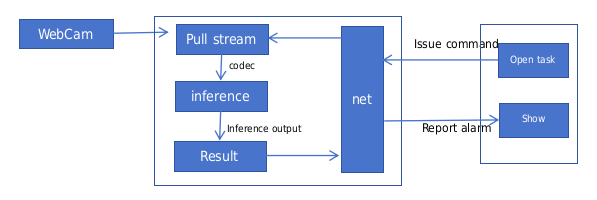

## Summary：

This project is a humanoid detection and alarm system developed based on AMD Ryzen AI Software, which can set up intrusion detection alarms in key areas. The detection model uses the YOLOV8 model, which can be implemented according to the official demo. link:<https://github.com/amd/RyzenAI-SW/tree/main/example/yolov8>。

## Development dependency
Run hardware：AMD Ryzen 9 7940HS

Development System：win11

Development tool：VS2019

Development language：C++11

Ryzen AI version：1.1

## Software

System architecture diagram：

## Compile and run
Compiling: Directly compiling with vs2019 will generate an out directory, which will generate the executable file ai_app.exe.

Run: We need to put OpenCV's DLL dynamic library and ai_app.exe in the same directory. And place yolov8_madel.onnx in the same level directory as ai_app.exe. We start the Win terminal and enter the ai_app.exe directory to execute ai_app.exe. At this point, we need to start another program with interface control to work together:<https://github.com/LYCUESTC/ai_control_system>

Third parties used：

eigen; jsoncpp; opencv

****
