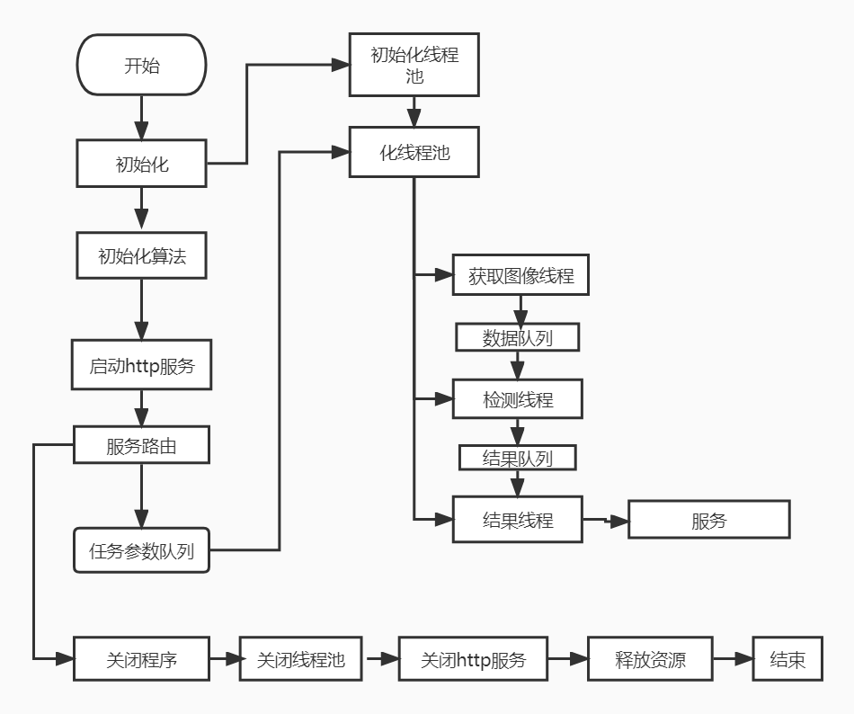

# Intrusion detection and alarm system

本项目是基于AMD Ryzen AI Software开发的一套人形检测报警系统，可以设置重点区域入侵检测报警。检测模型采用的是yolov8模型，可以根据官方demo实现。

开发环境：widows11

开发工具：VS2019

Ryzen AI版本：Version 1.1

系统流程图：

使用到的第三方：

eigen；jsoncpp；opencv

****
